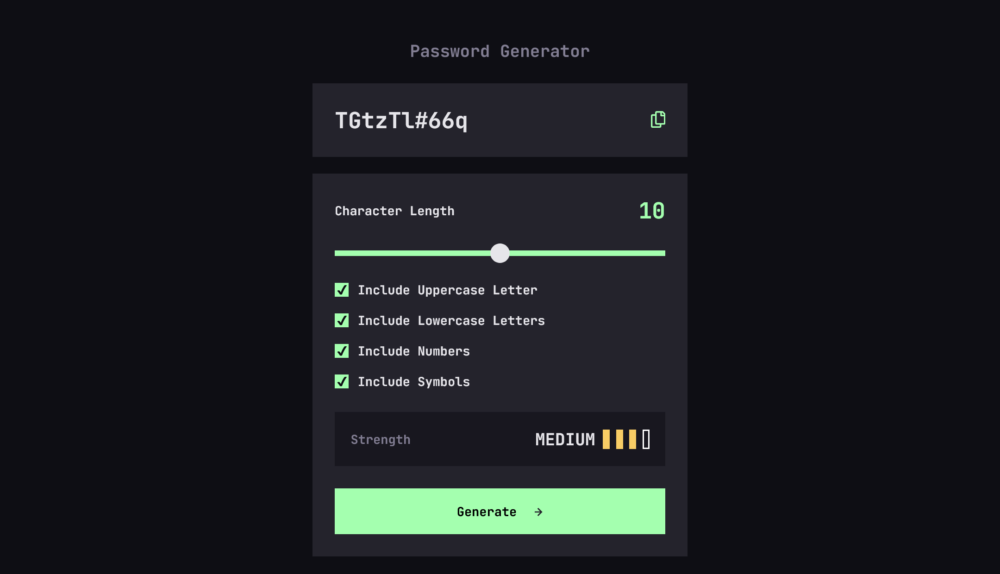
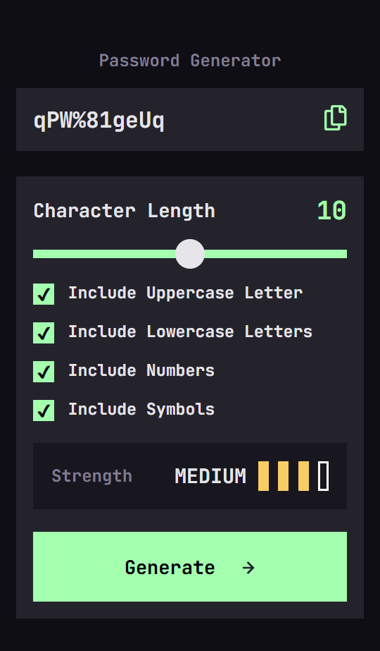

# Frontend Mentor - Password generator app solution

This is a solution to the
[Password generator app challenge on Frontend Mentor](https://www.frontendmentor.io/challenges/password-generator-app-Mr8CLycqjh).

## Table of contents

- [Overview](#overview)
  - [The challenge](#the-challenge)
  - [Screenshot](#screenshot)
  - [Links](#links)
- [My process](#my-process)
  - [Built with](#built-with)
  - [What I learned](#what-i-learned)
  - [Useful resources](#useful-resources)
- [Author](#author)
- [Acknowledgments](#acknowledgments)

## Overview

### The challenge

Users should be able to:

- Generate a password based on the selected inclusion options
- Copy the generated password to the computer's clipboard
- See a strength rating for their generated password
- View the optimal layout for the interface depending on their device's screen
  size
- See hover and focus states for all interactive elements on the page

### Screenshot

#### Screenshot - Desktop

#### Screenshot - Mobile

### Links

- Solution URL: [Github](https://github.com/LuisVera1/frontendMentor-Projects/tree/main/src/app/password-generator)
- Live Site URL: [Live solution](https://frontend-mentor-projects-five.vercel.app/password-generator)

## My process

### Built with

- Semantic HTML5 markup
- CSS custom properties
- Flexbox
- Mobile-first workflow
- [React](https://reactjs.org/) - JS library
- [Next.js](https://nextjs.org/) - React framework

### What I learned

This project was really interesting. I learned about styling checkboxes and
input-range across different browsers. It also helped me improve my coding
skills, especially when developing the algorithm to generate passwords and check
their strength.

### Useful resources

- [Input range generator](https://range-input-css.netlify.app/)
- [Checkbox generator](https://doodlenerd.com/html-control/css-checkbox-generator)

## Author

- Website - [Luisvera.dev](https://www.luisvera.dev)
- Frontend Mentor -
  [@LuisVera1](https://www.frontendmentor.io/profile/LuisVera1)

## Acknowledgments

Thanks to Frontend Mentor.
